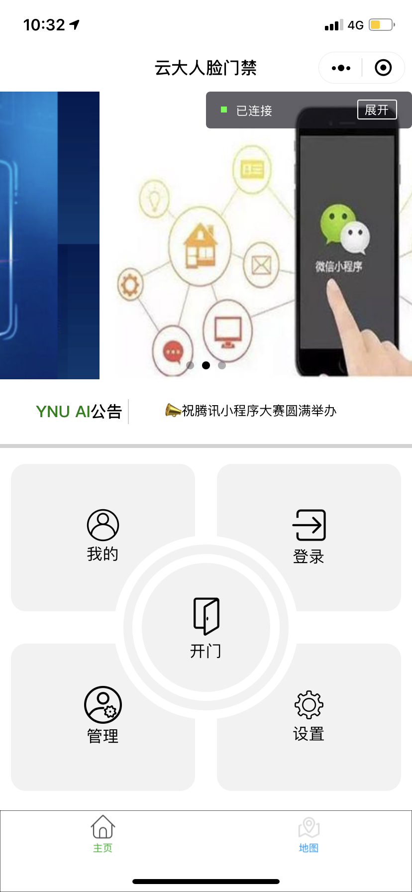
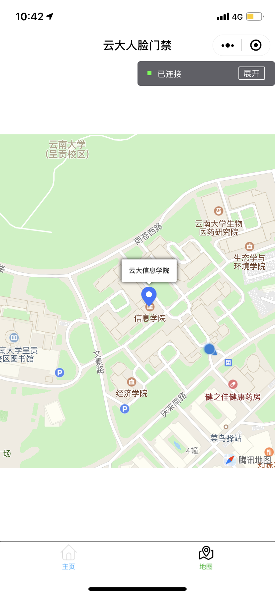
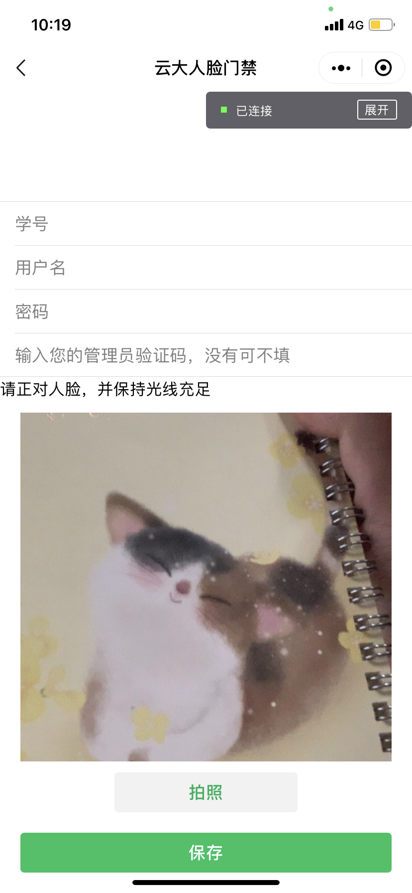
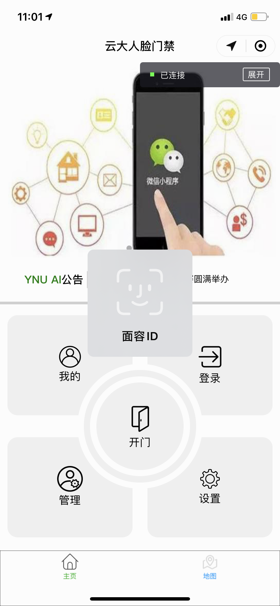

---

---

# WX-YNU-AI
## 项目名称：

云南大学人脸识别门禁系统

## 项目介绍：

**为了方便广大师生并保证开锁的安全性，我们开发了“云南大学人脸识别门禁系统”小程序，相对于感应卡式门禁系统，小程序有着独特的优势：**

1.学校内人人都有手机，小程序依靠微信这个使用者众多的平台，不需要下载，依托手机这个硬件，再加之云南大学的门禁识别设备均具有蓝牙，更换新的门禁系统几乎不需要任何部署成本。

2.手机的高频使用性极大的避免了忘记携带开锁工具的尴尬，而且绝大多数使用者的手机都具有解锁密码，再加上我们小程序内部调用的人脸识别以及指纹识别系统，即使不小心丢掉的手机被捡到，拾取者也不能影响到各个教室的安全。

3.小程序相对于感应卡，授予权限时非常方便，只需使用管理员的账号，进入小程序的“管理”界面，批量导入需要获得权限的学生的学号，就可以方便快捷进行权限的授予，同时，权限的取消也是轻而易举。

4.小程序的拓展性非常高，后期能够嵌入很多内容，可以作为一个发布校园信息的平台，方便同学们在及时了解公告、活动信息等，还可以作为一个接受通知的平台，使得小程序的功能更多元化。

## 项目效果图：

项目效果图如果加载不出来，可去img文件夹查看

## 小程序二维码：

## 部署教程:

## System environment:

ios 7.0.15 以上

android 7.0.18 以上

最新版微信

## Description:

下载微信开发者工具

> [项目网站](https://github.com/lwcsjzz/WX-YNU-AI)

并进入这个网站下载源代码

用微信开发者工具导入项目，APPID为wxea7382d1e9ad46b2

## 开源许可标注(MIT):

MIT License

Copyright (c) 2020 lwcsjzz

Permission is hereby granted, free of charge, to any person obtaining a copy
of this software and associated documentation files (the "Software"), to deal
in the Software without restriction, including without limitation the rights
to use, copy, modify, merge, publish, distribute, sublicense, and/or sell
copies of the Software, and to permit persons to whom the Software is
furnished to do so, subject to the following conditions:

The above copyright notice and this permission notice shall be included in all
copies or substantial portions of the Software.

THE SOFTWARE IS PROVIDED "AS IS", WITHOUT WARRANTY OF ANY KIND, EXPRESS OR
IMPLIED, INCLUDING BUT NOT LIMITED TO THE WARRANTIES OF MERCHANTABILITY,
FITNESS FOR A PARTICULAR PURPOSE AND NONINFRINGEMENT. IN NO EVENT SHALL THE
AUTHORS OR COPYRIGHT HOLDERS BE LIABLE FOR ANY CLAIM, DAMAGES OR OTHER
LIABILITY, WHETHER IN AN ACTION OF CONTRACT, TORT OR OTHERWISE, ARISING FROM,
OUT OF OR IN CONNECTION WITH THE SOFTWARE OR THE USE OR OTHER DEALINGS IN THE
SOFTWARE.